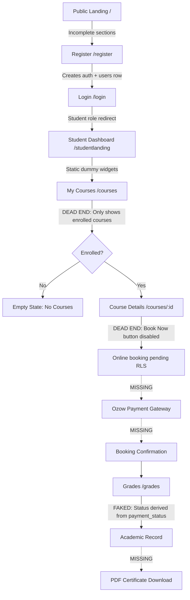
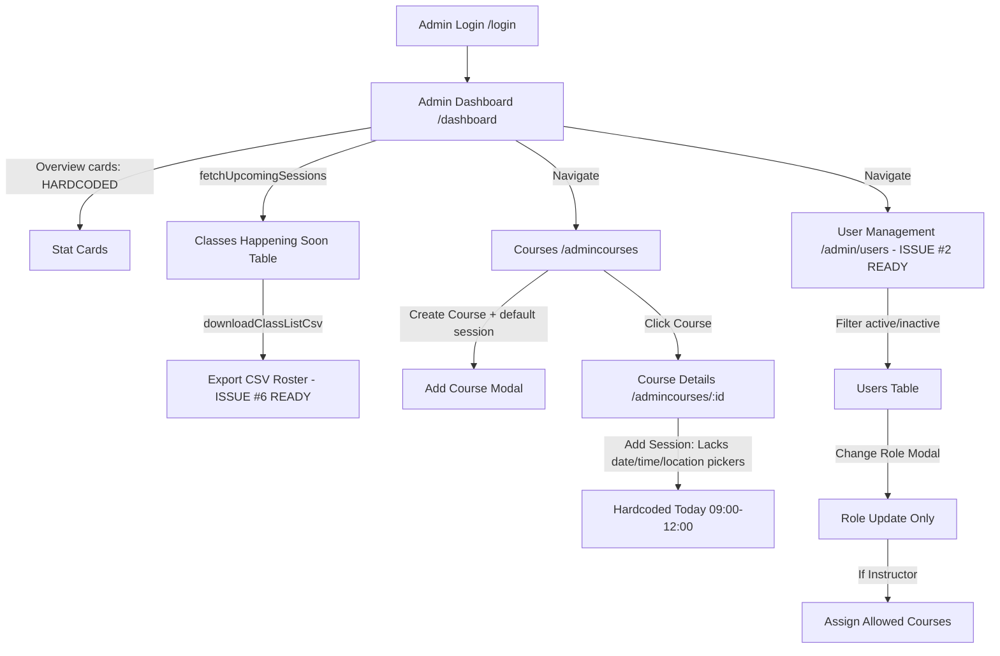
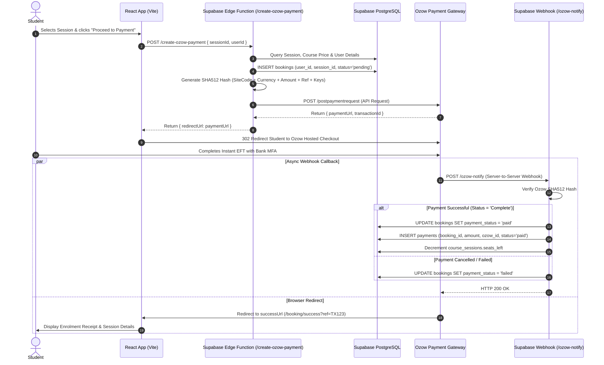
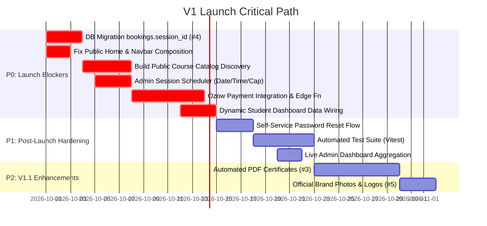

# Product Workflow, Feature Completeness & Business Logic Audit Report
**Target Platform:** `doctor_website_demo` (Continuing Medical Education Platform)  
**Workspace:** `/home/vaper/Work/Worktrees/doctor_app_demo/doctor_website_demo`  
**Auditor:** Principal Product Manager & Technical Business Analyst (Healthcare/EdTech)  
**Date:** September 2026  
**Branch Evaluated:** `vaperizer2`

---

## Table of Contents
1. [Executive Summary](#1-executive-summary)
2. [Student User Journey Audit](#2-student-user-journey-audit)
   - Landing Page & Discovery
   - Registration & Onboarding
   - Authentication & Session Guarding
   - Course Catalog vs Enrolled Courses Gap
   - Session Selection & Booking Blocker
   - Payment Initiation Void
   - Academic Progress & Fake Grading
   - Certificate Issuance Absence
3. [Admin / Doctor User Journey Audit](#3-admin--doctor-user-journey-audit)
   - Overview Dashboard Metrics
   - Course Creation & Management
   - Session Scheduling Deficiencies
   - Instructor Course Permissions
   - User Management & RBAC Security
   - Class List Roster Export Verification
4. [GitHub Issues Status & Resolution Matrix](#4-github-issues-status--resolution-matrix)
   - Issues #2 and #6: Immediate Closure Analysis
   - Issues #1, #3, #4, #5: Detailed Gap & Next Steps Analysis
5. [Ozow Payment Gateway Integration Specification](#5-ozow-payment-gateway-integration-specification)
   - High-Level Architecture & Entity Flow
   - Step-by-Step Transaction Lifecycle
   - Data Model Changes & Migrations
   - Security & Webhook Idempotency Requirements
6. [Ranked V1 Launch Roadmap & Feature Checklist](#6-ranked-v1-launch-roadmap--feature-checklist)
   - P0: Must-Haves (Launch Blockers)
   - P1: Fast-Follows (Post-Launch Hardening)
   - P2: Nice-to-Haves (V1.1 Enhancements)

---

## 1. Executive Summary

A comprehensive product and technical business audit was conducted on the CME (Continuing Medical Education) platform codebase. The application aims to deliver accredited medical training courses, manage session schedules across medical centres, process instant EFT tuition fees via Ozow, record course completion, and export attendee rosters for doctors and training coordinators.

### Current Health Summary
| Domain | Readiness | Verdict | Primary Deficiency |
| :--- | :---: | :--- | :--- |
| **Authentication & RBAC** | **90%** | Production-Ready Foundation | Password reset self-service missing ([ForgotPassword.tsx](file:///home/vaper/Work/Worktrees/doctor_app_demo/doctor_website_demo/src/pages/ForgotPassword.tsx#L40-L55)). |
| **User Management (Issue #2)** | **95%** | **Ready to Close** | Fully implemented in [AdminUsers.tsx](file:///home/vaper/Work/Worktrees/doctor_app_demo/doctor_website_demo/src/pages/AdminUsers.tsx) & [StudentProfile.tsx](file:///home/vaper/Work/Worktrees/doctor_app_demo/doctor_website_demo/src/pages/StudentProfile.tsx). |
| **Class Lists (Issue #6)** | **90%** | **Ready to Close** | CSV export functional in [classLists.ts](file:///home/vaper/Work/Worktrees/doctor_app_demo/doctor_website_demo/src/lib/classLists.ts) and [AdminLanding.tsx](file:///home/vaper/Work/Worktrees/doctor_app_demo/doctor_website_demo/src/pages/AdminLanding.tsx). |
| **Course Catalog & Booking** | **25%** | **Critical Blocker** | No public catalog discovery; "Book now" button hardcoded disabled in [StudentCourseDetails.tsx:240-249](file:///home/vaper/Work/Worktrees/doctor_app_demo/doctor_website_demo/src/pages/StudentCourseDetails.tsx#L240-L249). |
| **Ozow Payment Integration** | **0%** | **Critical Blocker** | Zero gateway integration, no webhook endpoint, no transaction handler. |
| **Academic Records & PDFs (#3)** | **10%** | Not Started | [AdminGrades.tsx](file:///home/vaper/Work/Worktrees/doctor_app_demo/doctor_website_demo/src/pages/AdminGrades.tsx) empty; student grades faked from `payment_status`; no PDF engine. |
| **Database Schema & RLS (#4)** | **60%** | Structural Bottleneck | `bookings` table links to `course_id` instead of `session_id`; RLS blocks student self-booking. |

---

## 2. Student User Journey Audit



### 2.1 Landing Page (`/` → [Home.tsx](file:///home/vaper/Work/Worktrees/doctor_app_demo/doctor_website_demo/src/pages/Home.tsx))
* **Implementation Status:** Incomplete Composition.
* **Code Reference:** [Home.tsx:1-14](file:///home/vaper/Work/Worktrees/doctor_app_demo/doctor_website_demo/src/pages/Home.tsx#L1-L14) only renders `<Hero />`. It neglects to render `<LandingNav />` from [Navbar.tsx](file:///home/vaper/Work/Worktrees/doctor_app_demo/doctor_website_demo/src/components/Navbar.tsx#L104-L117) and omits `<AboutWebsite />` and `<AboutDoctor />` defined in [Hero.tsx:180-265](file:///home/vaper/Work/Worktrees/doctor_app_demo/doctor_website_demo/src/components/Hero.tsx#L180-L265).
* **Gaps & Dead Ends:**
  1. The top navigation bar is absent, leaving users with no fixed anchors or navigation header.
  2. Prospective students cannot see course overviews, CPD point accreditations, or pricing prior to creating an account.
  3. The primary CTA "Make a booking" links directly to `/register` without pre-selecting or previewing a course.

### 2.2 Registration (`/register` → [Register.tsx](file:///home/vaper/Work/Worktrees/doctor_app_demo/doctor_website_demo/src/pages/Register.tsx))
* **Implementation Status:** Highly polished 3-step wizard.
* **Code Reference:** [Register.tsx:185-265](file:///home/vaper/Work/Worktrees/doctor_app_demo/doctor_website_demo/src/pages/Register.tsx#L185-L265) captures personal details, citizenship toggle (13-digit SA ID vs Passport), cell phone, and optional HPCSA/SANC number.
* **Logic Evaluation:** Dynamically resolves `studentRoleId` via [roles.ts:findRoleIdByName](file:///home/vaper/Work/Worktrees/doctor_app_demo/doctor_website_demo/src/lib/roles.ts#L43-L52), registers Supabase auth user, and inserts into `public.users`. Redirects to `/login` with `state: { registered: true }`.
* **Gaps:** If Supabase email confirmation is enabled (`data.session === null`), the UI shows an inline banner "Please check your email" ([Register.tsx:216-220](file:///home/vaper/Work/Worktrees/doctor_app_demo/doctor_website_demo/src/pages/Register.tsx#L216-L220)). However, if a user attempts to log in before confirming, error messaging from Supabase ("Email not confirmed") is raw.

### 2.3 Login & Session Guarding (`/login` → [Login.tsx](file:///home/vaper/Work/Worktrees/doctor_app_demo/doctor_website_demo/src/pages/Login.tsx))
* **Implementation Status:** Fully functional production auth.
* **Code Reference:** [Login.tsx:109-136](file:///home/vaper/Work/Worktrees/doctor_app_demo/doctor_website_demo/src/pages/Login.tsx#L109-L136) calls `supabase.auth.signInWithPassword`, verifies active profile in `users` via [auth.ts:getSessionUser](file:///home/vaper/Work/Worktrees/doctor_app_demo/doctor_website_demo/src/lib/auth.ts#L17-L34), and routes to `/dashboard` for admin or `/studentlanding` for students.
* **Route Guards:** [RequireAuth.tsx](file:///home/vaper/Work/Worktrees/doctor_app_demo/doctor_website_demo/src/components/RequireAuth.tsx#L13-L45) successfully blocks unauthorized cross-role access and redirects unauthenticated users to `/login`.

### 2.4 Student Dashboard (`/studentlanding` → [StudentLanding.tsx](file:///home/vaper/Work/Worktrees/doctor_app_demo/doctor_website_demo/src/pages/StudentLanding.tsx))
* **Implementation Status:** Visual Mockup Only (Static Dummy Data).
* **Code References:**
  - Header hardcodes "Welcome back, John" ([StudentLanding.tsx:149-152](file:///home/vaper/Work/Worktrees/doctor_app_demo/doctor_website_demo/src/pages/StudentLanding.tsx#L149-L152)).
  - Next Session Banner hardcodes "Lobotomy 101 · 1 April 2026" ([StudentLanding.tsx:155-177](file:///home/vaper/Work/Worktrees/doctor_app_demo/doctor_website_demo/src/pages/StudentLanding.tsx#L155-L177)) and the button `<button className="nb-btn">View session</button>` has **no click handler or route link**.
  - Upcoming classes, grades, and notifications arrays are static constants ([StudentLanding.tsx:114-131](file:///home/vaper/Work/Worktrees/doctor_app_demo/doctor_website_demo/src/pages/StudentLanding.tsx#L114-L131)) and do not query Supabase.

### 2.5 The Course Catalog Discovery Void (`/courses` → [StudentCourses.tsx](file:///home/vaper/Work/Worktrees/doctor_app_demo/doctor_website_demo/src/pages/StudentCourses.tsx))
* **Critical Architectural Gap:**
  - In [StudentCourses.tsx:112-136](file:///home/vaper/Work/Worktrees/doctor_app_demo/doctor_website_demo/src/pages/StudentCourses.tsx#L112-L136), the page title is "My courses" and it invokes `fetchStudentCourses(user.id)`.
  - [studentCourses.ts:39-44](file:///home/vaper/Work/Worktrees/doctor_app_demo/doctor_website_demo/src/lib/studentCourses.ts#L39-L44) queries `bookings` where `user_id = userId`.
  - **Dead End:** A newly registered student has zero bookings. They are shown: *"You are not enrolled in any courses yet."* **There is no catalog tab or page where an un-enrolled student can discover courses to enroll in!** Students cannot reach `/courses/:id` through the UI unless they already have a booking row.

### 2.6 Session Selection & The Booking Blocker (`/courses/:id` → [StudentCourseDetails.tsx](file:///home/vaper/Work/Worktrees/doctor_app_demo/doctor_website_demo/src/pages/StudentCourseDetails.tsx))
* **Implementation Status:** Read-only schedule viewer; write flow disabled.
* **Code Reference:**
  ```tsx
  // StudentCourseDetails.tsx: lines 240-249
  <button
    className="book-btn"
    type="button"
    disabled
    title="Online booking pending server RLS (issue #4)"
    aria-label="Book now — online booking not yet available"
  >
    Book now
  </button>
  ```
* **Gaps:**
  1. The booking button is hard-disabled.
  2. While the component contains CSS and comments for a `<div className="modal-overlay">` booking modal ([StudentCourseDetails.tsx:8-12, 114-129](file:///home/vaper/Work/Worktrees/doctor_app_demo/doctor_website_demo/src/pages/StudentCourseDetails.tsx#L8-L12)), no state toggle or modal trigger is wired in the JSX.
  3. No booking request can be initiated by a student.

### 2.7 Payment Initiation & Tracking
* **Implementation Status:** Completely Absent (0%).
* **Gaps:** No payment gateway client or server edge function exists. There is no concept of a transaction reference, Ozow redirect URL, or payment status listener.

### 2.8 Academic Records & Faked Grades (`/grades` → [StudentGrades.tsx](file:///home/vaper/Work/Worktrees/doctor_app_demo/doctor_website_demo/src/pages/StudentGrades.tsx))
* **Critical Business Logic Flaw:**
  - In [studentCourses.ts:28-36](file:///home/vaper/Work/Worktrees/doctor_app_demo/doctor_website_demo/src/lib/studentCourses.ts#L28-L36):
    ```ts
    function statusFromPayment(paymentStatus: string): CourseStatus {
      const normalized = paymentStatus.toLowerCase();
      if (normalized === "passed" || normalized === "complete" || normalized === "completed") {
        return "passed";
      }
      if (normalized === "failed" || normalized === "fail") {
        return "failed";
      }
      return "pending";
    }
    ```
  - Academic competence ("Passed" vs "Failed") is derived directly from whether the tuition payment was processed! A student who pays their course fee is automatically flagged as "Passed" and "Complete" ([StudentGrades.tsx:165-172](file:///home/vaper/Work/Worktrees/doctor_app_demo/doctor_website_demo/src/pages/StudentGrades.tsx#L165-L172)).
  - There is no assessment score, attendance confirmation, or instructor gradebook.
  - **Issue #3 Blocker:** No PDF certificate generation or download functionality exists.

---

## 3. Admin / Doctor User Journey Audit



### 3.1 Overview Dashboard (`/dashboard` → [AdminLanding.tsx](file:///home/vaper/Work/Worktrees/doctor_app_demo/doctor_website_demo/src/pages/AdminLanding.tsx))
* **Metrics Integrity:**
  - The three top stat cards ("Total Students: 1,284", "Active Courses: 32", "Revenue (MTD): R 54k") in [AdminLanding.tsx:162-177](file:///home/vaper/Work/Worktrees/doctor_app_demo/doctor_website_demo/src/pages/AdminLanding.tsx#L162-L177) are **hardcoded static strings**. They do not aggregate live database counts.
* **Classes Happening Soon:**
  - Implemented cleanly via `fetchUpcomingSessions()` in [classLists.ts:46-104](file:///home/vaper/Work/Worktrees/doctor_app_demo/doctor_website_demo/src/lib/classLists.ts#L46-L104).
  - Queries active courses, matches active sessions, and filters bookings where `payment_status === 'paid'`.

### 3.2 Course Creation (`/admincourses` → [AdminCourse.tsx](file:///home/vaper/Work/Worktrees/doctor_app_demo/doctor_website_demo/src/pages/AdminCourse.tsx))
* **Implementation Status:** Functional Course Creator.
* **Code Reference:** [AdminCourse.tsx:289-328](file:///home/vaper/Work/Worktrees/doctor_app_demo/doctor_website_demo/src/pages/AdminCourse.tsx#L289-L328) handles insertion into `courses` table (`course_title`, `course_description`, `course_price`, `active: true`).
* **Side-Effect Limitation:** Upon creating a course, it automatically creates a dummy initial session via `firstLocationId()` with today's date, 09:00–12:00, and max 20 students. While convenient for bootstrapping, it bypasses deliberate session scheduling.

### 3.3 Session Scheduling Deficiencies (`/admincourses/:id` → [AdminCourseDetails.tsx](file:///home/vaper/Work/Worktrees/doctor_app_demo/doctor_website_demo/src/pages/AdminCourseDetails.tsx))
* **Critical Administrative Gap:**
  - When an admin clicks "Add a class session", the modal ([AdminCourseDetails.tsx:117-152](file:///home/vaper/Work/Worktrees/doctor_app_demo/doctor_website_demo/src/pages/AdminCourseDetails.tsx#L117-L152)) **only displays a single dropdown for "Teacher"**.
  - In [AdminCourseDetails.tsx:219-245](file:///home/vaper/Work/Worktrees/doctor_app_demo/doctor_website_demo/src/pages/AdminCourseDetails.tsx#L219-L245), the session date, time, capacity, and location are hardcoded:
    ```ts
    start_date: new Date().toISOString().slice(0, 10),
    end_date: new Date().toISOString().slice(0, 10),
    start_time: "09:00:00",
    end_time: "12:00:00",
    max_students: 20,
    active: true,
    ```
  - **Verdict:** An administrator **cannot** schedule future training sessions for next month, cannot configure multi-day seminars, cannot select which clinic/facility holds the session, and cannot alter seat limits.

### 3.4 User Management & RBAC Security (`/admin/users` → [AdminUsers.tsx](file:///home/vaper/Work/Worktrees/doctor_app_demo/doctor_website_demo/src/pages/AdminUsers.tsx))
* **Implementation Status:** Fully Compliant with Issue #2 Requirements.
* **Code Reference:** [AdminUsers.tsx:118-212](file:///home/vaper/Work/Worktrees/doctor_app_demo/doctor_website_demo/src/pages/AdminUsers.tsx#L118-L212).
* **Security Strengths:**
  1. **Role-Only Mutation:** Admin cannot edit student/instructor names, emails, ID numbers, or phone numbers from this interface. Only `role_id` and assigned teaching courses are modifiable.
  2. **Self-Demotion Lockout:** `disabled={u.id === currentUserId}` ([AdminUsers.tsx:376](file:///home/vaper/Work/Worktrees/doctor_app_demo/doctor_website_demo/src/pages/AdminUsers.tsx#L376)) prevents the logged-in administrator from revoking their own administrative permissions.
  3. **Instructor Multi-Course Assignment:** If a user is promoted to "Instructor", a course checkbox list appears allowing granular assignment of which courses they may teach, managed via `instructor_courses` table ([AdminUsers.tsx:185-207](file:///home/vaper/Work/Worktrees/doctor_app_demo/doctor_website_demo/src/pages/AdminUsers.tsx#L185-L207)).

### 3.5 Class List Roster Export (`/dashboard` → [classLists.ts](file:///home/vaper/Work/Worktrees/doctor_app_demo/doctor_website_demo/src/lib/classLists.ts))
* **Implementation Status:** Fully Compliant with Issue #6 Requirements.
* **Code Reference:** [classLists.ts:106-136](file:///home/vaper/Work/Worktrees/doctor_app_demo/doctor_website_demo/src/lib/classLists.ts#L106-L136).
* **Functionality:**
  - Client-side zero-dependency RFC-4180 compliant CSV generator (`downloadCsv`).
  - Required columns: `Class`, `Date`, `Instructor`, `Student name`, `Student email`.
  - Only includes students where `bookings.payment_status === 'paid'`.
  - Handles empty rosters cleanly with informative UI badges.

---

## 4. GitHub Issues Status & Resolution Matrix

| Issue # | Title | Current State in Codebase | Recommendation | Blockers / Outstanding Tasks |
| :---: | :--- | :--- | :---: | :--- |
| **#1** | **Testing & Security** | Partially Complete (Auth & Guards Done, Tests Missing) | **KEEP OPEN** | Automated test suite (Vitest/Playwright) missing; forgot-password email flow is a stub. |
| **#2** | **Users Management** | **100% Implemented & Verified** | **CLOSE IMMEDIATELY** | None. Admin can only change role; student profile is self-scoped and secure. |
| **#3** | **Grades & PDF Certificates** | Stubbed / Faked (Not Started) | **KEEP OPEN** | Needs assessment data model, instructor grading interface, and PDF certificate generator. |
| **#4** | **DB Schema & RLS** | Incomplete (Structural Schema Defect) | **KEEP OPEN** | `bookings.session_id` FK missing; RLS write policy needed for student bookings. |
| **#5** | **Frontend Assets** | Scaffolded (Blocked on Client Assets) | **KEEP OPEN** | Awaiting doctor's high-res photographs, clinic imagery, and official SVG logos. |
| **#6** | **Class Lists Export** | **100% Implemented & Verified** | **CLOSE IMMEDIATELY** | None. CSV export downloads paid student roster with class, date, instructor, and student info. |

### Detailed Analysis of Issues

#### Issue #2 (Users) — Ready to Close Immediately
* **Criteria Checklist:**
  - [x] Student can view and edit only their own personal details ([StudentProfile.tsx:142-169](file:///home/vaper/Work/Worktrees/doctor_app_demo/doctor_website_demo/src/pages/StudentProfile.tsx#L142-L169)).
  - [x] Student cannot change their own role or active status (fields rendered read-only, omitted from Supabase update payload in [StudentProfile.tsx:147-156](file:///home/vaper/Work/Worktrees/doctor_app_demo/doctor_website_demo/src/pages/StudentProfile.tsx#L147-L156)).
  - [x] Admin can view all users (active and inactive with filter pills in [AdminUsers.tsx:308-319](file:///home/vaper/Work/Worktrees/doctor_app_demo/doctor_website_demo/src/pages/AdminUsers.tsx#L308-L319)).
  - [x] Admin can change user role via modal ([AdminUsers.tsx:118-184](file:///home/vaper/Work/Worktrees/doctor_app_demo/doctor_website_demo/src/pages/AdminUsers.tsx#L118-L184)).
  - [x] Admin cannot edit user personal data (security requirement satisfied).
  - [x] Self-demotion lockout implemented ([AdminUsers.tsx:142, 376](file:///home/vaper/Work/Worktrees/doctor_app_demo/doctor_website_demo/src/pages/AdminUsers.tsx#L142)).
* **Conclusion:** Issue #2 is fully satisfied and can be closed on GitHub without code changes.

#### Issue #6 (Class Lists) — Ready to Close Immediately
* **Criteria Checklist:**
  - [x] Export button accessible in Admin Dashboard ([AdminLanding.tsx:219-232](file:///home/vaper/Work/Worktrees/doctor_app_demo/doctor_website_demo/src/pages/AdminLanding.tsx#L219-L232)).
  - [x] Class details included: Course title, Date, Instructor ([classLists.ts:121-133](file:///home/vaper/Work/Worktrees/doctor_app_demo/doctor_website_demo/src/lib/classLists.ts#L121-L133)).
  - [x] Attendee filtering: Strictly paid attendees (`isPaid(payment_status)` in [classLists.ts:42, 85](file:///home/vaper/Work/Worktrees/doctor_app_demo/doctor_website_demo/src/lib/classLists.ts#L42)).
  - [x] Zero-dependency CSV download triggered in browser with correct MIME type ([classLists.ts:106-118](file:///home/vaper/Work/Worktrees/doctor_app_demo/doctor_website_demo/src/lib/classLists.ts#L106-L118)).
* **Conclusion:** Issue #6 is fully satisfied under the current schema. *(Note: Once Issue #4 shifts bookings to `session_id`, `classLists.ts` query will simply join on `session_id`, but the feature contract is 100% delivered).*

#### Issue #1 (Testing & Security) — What Remains
1. **Automated Testing Suite:** The project has zero test files (`.test.ts`, `.spec.tsx`). A unit/integration test runner (Vitest + Testing Library) must be configured to test auth state transitions, route guarding, and role updates.
2. **Password Reset Flow:** [ForgotPassword.tsx](file:///home/vaper/Work/Worktrees/doctor_app_demo/doctor_website_demo/src/pages/ForgotPassword.tsx) is an inert visual mock. Requires wiring `supabase.auth.resetPasswordForEmail(email, { redirectTo })` and handling the callback token.
3. **Session Expiry & Token Refresh:** Verification that token expiry redirects cleanly to `/login` without unhandled Supabase SDK exceptions.

#### Issue #3 (Grades / PDFs) — What Remains
1. **Database Schema:** Create a `course_grades` or `certifications` table (`id, booking_id, user_id, course_id, score, passed, certified_at, certificate_number`).
2. **Admin Grading UI:** [AdminGrades.tsx](file:///home/vaper/Work/Worktrees/doctor_app_demo/doctor_website_demo/src/pages/AdminGrades.tsx) must be converted from dead CSS into an instructor gradebook where instructors can submit pass/fail marks for session attendees.
3. **PDF Certificate Generation:** Integrate a lightweight PDF generation library (e.g. `@react-pdf/renderer` or `jspdf` + canvas template) with doctor signature, SANC accreditation badge, CPD points, and dynamic student details.

#### Issue #4 (Database Schema & RLS) — What Remains
1. **Schema Correction (`bookings.session_id`):** Current bookings table schema:
   ```sql
   bookings (id, user_id, course_id, payment_status, material_fee, total_amount)
   ```
   **Must be migrated to:**
   ```sql
   bookings (id, user_id, session_id, course_id, payment_status, material_fee, total_amount)
   ```
   Students reserve specific time slots and locations (e.g., Cape Town Medical Centre on 14 October 2026). Without `session_id`, two concurrent sessions of the same course cannot manage seat capacity (`max_students`).
2. **Row Level Security (RLS) Policies:**
   - Policy allowing authenticated students to `INSERT` into `bookings` with status `'pending'`.
   - Policy restricting students to `SELECT` only their own bookings and payments.
   - Policy allowing service role (webhook) to `UPDATE` booking status to `'paid'`.

#### Issue #5 (Assets) — What Remains
- Integrate received SVG logos into [Navbar.tsx](file:///home/vaper/Work/Worktrees/doctor_app_demo/doctor_website_demo/src/components/Navbar.tsx) and [Hero.tsx](file:///home/vaper/Work/Worktrees/doctor_app_demo/doctor_website_demo/src/components/Hero.tsx).
- Replace fallback initials avatar with official doctor photography in [AboutDoctor.tsx](file:///home/vaper/Work/Worktrees/doctor_app_demo/doctor_website_demo/src/components/Hero.tsx#L235-L255).
- Place static assets in `public/brand/` and reference via absolute paths.

---

## 5. Ozow Payment Gateway Integration Specification

Ozow (formerly i-Pay) is South Africa’s leading automated Instant EFT payment provider, interfacing with all major retail banks (ABSA, Capitec, FNB, Nedbank, Standard Bank, Investec, Discovery Bank, TymeBank).

### 5.1 End-to-End Architectural Sequence



### 5.2 Step-by-Step Business Logic Requirements

#### Step 1: Booking Initiation & Capacity Lock
1. Student clicks "Book Session" on [StudentCourseDetails.tsx](file:///home/vaper/Work/Worktrees/doctor_app_demo/doctor_website_demo/src/pages/StudentCourseDetails.tsx).
2. The client invokes a secure serverless endpoint (`create-ozow-payment`) rather than calling Ozow directly from the browser (Ozow Private Key must never touch the frontend).
3. The server checks `course_sessions.seats_left > 0`.
4. Creates a `bookings` record with `payment_status = 'pending'` and a 15-minute reservation TTL.

#### Step 2: Payment Request Generation & Checksum Hashing
Ozow requires a SHA-512 checksum generated from concatenated payload values and the private key:
* **Fields:**
  - `SiteCode`: Provided by Ozow merchant dashboard.
  - `CountryCode`: `"ZA"`
  - `CurrencyCode`: `"ZAR"`
  - `Amount`: Formatted to 2 decimal places (e.g., `"1499.00"`).
  - `TransactionReference`: Unique identifier (e.g., `MED-${bookingId}`).
  - `BankReference`: Max 20 alphanumeric chars shown on student's bank statement.
  - `Customer`: Student full name.
  - `CancelUrl`: `https://platform.medlearn.co.za/booking/cancelled`
  - `ErrorUrl`: `https://platform.medlearn.co.za/booking/error`
  - `SuccessUrl`: `https://platform.medlearn.co.za/booking/success`
  - `NotifyUrl`: `https://fwgwgeehrronfqilkdha.supabase.co/functions/v1/ozow-notify`
* **Hash Calculation (Lowercase string concatenation):**
  `hash = SHA512(SiteCode + CountryCode + CurrencyCode + Amount + TransactionReference + BankReference + OptionalFields... + PrivateKey)`

#### Step 3: Hosted Gateway Redirection
The frontend receives the generated `paymentUrl` from the Edge Function and redirects the student to Ozow's secure hosted payment UI.

#### Step 4: Webhook Notification & Signature Verification (Idempotency)
1. When payment finishes, Ozow dispatches a `POST` request to `NotifyUrl`.
2. **Security Verification:** The backend recalculates the SHA-512 hash using the posted fields and `PrivateKey`. If hashes do not match, reject with `HTTP 400 Bad Request`.
3. **Idempotency:** Webhook notifications may be retried. The handler checks if `bookings.payment_status === 'paid'`. If already processed, return `HTTP 200 OK` immediately without duplicate payment entries or decrementing seats again.
4. **Transaction Commit:**
   - Update `bookings.payment_status = 'paid'`
   - Insert row into `payments` table (`booking_id`, `amount`, `payment_method = 'ozow'`, `transaction_id = OzowTransactionId`, `created_at = now()`)
   - Send confirmation email with session venue, date, and tax invoice.

#### Step 5: User Redirection
* **Success:** Student arrives at `/booking/success`, querying their booking and viewing calendar invitation links (.ics file download).
* **Failure/Cancellation:** Student returns to `/booking/cancelled` with option to retry or pick an alternative session.

---

## 6. Ranked V1 Launch Roadmap & Feature Checklist



### 6.1 Priority 0: Launch Blockers (Must-Have for V1.0)
Without these 6 items, the product cannot transact or fulfill training bookings.

1. **Database Schema & RLS Repair (Issue #4):**
   - Add `session_id UUID REFERENCES course_sessions(id)` to `bookings` table.
   - Deploy RLS policy allowing authenticated students to insert pending bookings.
   - *Impact:* Unlocks seat counts, prevents double-booking, and enables real session enrollment.
2. **Public Landing Page & Navigation Repair:**
   - In [Home.tsx](file:///home/vaper/Work/Worktrees/doctor_app_demo/doctor_website_demo/src/pages/Home.tsx), import and render `<LandingNav />`, `<Hero />`, `<AboutWebsite />`, `<AboutDoctor />`.
   - Ensure "Platform", "About", "Sign in", and "Get started" anchor links work on mobile and desktop.
3. **Public & Student Course Catalog Discovery:**
   - Separate "My Enrolled Courses" from "Course Catalog".
   - Create `/catalog` (or a toggle on `/courses`) listing all active courses from Supabase `courses` table so un-enrolled students can browse curriculum, prices, and available dates.
4. **Comprehensive Admin Session Scheduling:**
   - Upgrade [AdminCourseDetails.tsx:AddSessionModal](file:///home/vaper/Work/Worktrees/doctor_app_demo/doctor_website_demo/src/pages/AdminCourseDetails.tsx#L117-L152) to include:
     - Date pickers (`start_date`, `end_date`)
     - Time inputs (`start_time`, `end_time`)
     - Location dropdown selector (from `locations` table)
     - Seat capacity input (`max_students`)
5. **Ozow Payment Flow Implementation:**
   - Create Supabase Edge Function `create-ozow-payment` to generate SHA-512 hash and request Ozow checkout URL.
   - Wire "Book Now" button on [StudentCourseDetails.tsx](file:///home/vaper/Work/Worktrees/doctor_app_demo/doctor_website_demo/src/pages/StudentCourseDetails.tsx#L240) to initiate payment.
   - Deploy webhook endpoint `ozow-notify` to confirm payments and update `bookings.payment_status = 'paid'`.
   - Add `/booking/success` and `/booking/cancelled` routes.
6. **Dynamic Student Dashboard:**
   - In [StudentLanding.tsx](file:///home/vaper/Work/Worktrees/doctor_app_demo/doctor_website_demo/src/pages/StudentLanding.tsx), replace hardcoded "John", "Lobotomy 101", and dummy arrays with real user profile data and real query from `bookings` + `course_sessions`.

---

### 6.2 Priority 1: Fast-Follows (Must-Have within 30 Days of Launch)
Required for operational stability and support reduction.

1. **Password Reset Flow:**
   - Replace placeholder in [ForgotPassword.tsx](file:///home/vaper/Work/Worktrees/doctor_app_demo/doctor_website_demo/src/pages/ForgotPassword.tsx) with active `supabase.auth.resetPasswordForEmail`.
2. **Automated Unit & E2E Testing Suite (Issue #1):**
   - Install Vitest, jsdom, and React Testing Library.
   - Add unit tests for `RequireAuth`, `roles.ts`, `classLists.ts`, and payment hash generation.
3. **Live Admin Dashboard Statistics:**
   - Replace static numbers in [AdminLanding.tsx](file:///home/vaper/Work/Worktrees/doctor_app_demo/doctor_website_demo/src/pages/AdminLanding.tsx#L162-L177) with live SQL counts (`COUNT(users)`, `COUNT(courses)`, `SUM(payments.amount)`).

---

### 6.3 Priority 2: Nice-to-Have (V1.1 Enhancements)
Value-add features that do not impede initial revenue generation.

1. **Automated PDF Certificate Generation (Issue #3):**
   - Build certificate issuance pipeline with SANC registration number, CPD points, and download button.
2. **Doctor & Clinic Branding Assets (Issue #5):**
   - Swap placeholders with client-provided photography once photoshoot assets are delivered.
3. **In-App Notification Feed:**
   - Replace static notifications in [StudentNotifications.tsx](file:///home/vaper/Work/Worktrees/doctor_app_demo/doctor_website_demo/src/pages/StudentNotifications.tsx) with database-driven trigger events (e.g. "Payment confirmed", "Session reminder 24h prior").
