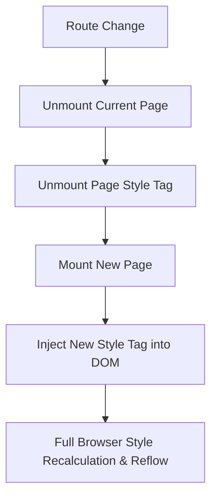

# Architectural, Code Quality, and Build Pipeline Audit Report
**Project:** `doctor_website_demo`  
**Repository Path:** `/home/vaper/Work/Worktrees/doctor_app_demo/doctor_website_demo`  
**Target Release:** V1.0  
**Auditor:** Principal Frontend Architect & DevOps Engineer  
**Date:** September 2026

---

## Executive Summary

An in-depth architectural and build audit was conducted on the `doctor_website_demo` codebase. While foundational workflows (Supabase Auth integration, role resolution, and responsive table views) have been established, the application exhibits critical architectural debt, configuration inconsistencies, bundle size inflation (>500 kB single chunk), and error resilience vulnerabilities that threaten production readiness for V1.

### Key Audit Findings at a Glance
| Area | Status | Critical Issues |
| :--- | :--- | :--- |
| **1. Build & Lint Integrity** | ⚠️ Warning | Sync `setState` in `StudentCourseDetails.tsx:173`, missing exhaustive-deps in `AdminCourseDetails.tsx:283`, PostCSS/Tailwind v4 redundancy, ECMAScript mismatch. |
| **2. Architecture & Duplication** | 🛑 High Debt | ~1000 lines of duplicated inline CSS, lack of React Router nested layouts (`Outlet`), orphaned legacy components (`SideNav.tsx`, `AboutDoctor.tsx`), mock static data on dashboards. |
| **3. Bundle Size & Performance** | 🛑 High Debt | Single 598.8 kB bundle chunk (exceeds Vite 500 kB budget); 0% code-splitting; static imports for all 15 routes in `App.tsx`. |
| **4. Error Handling & Resilience** | 🛑 High Debt | Zero `ErrorBoundary` components; top-level `supabaseClient.ts` crash on missing env vars; race conditions and orphaned auth sessions on login/register. |
| **5. V1 Readiness** | ⚠️ Blocked | Database trigger needed for user creation, unified AuthContext required to eliminate route flash and network waterfalls. |

---

## 1. Build, Lint & Type-Safety Integrity

### 1.1 Diagnosis of ESLint Issues in Course Detail Pages

#### A. Error / Issue in [StudentCourseDetails.tsx:L170-L199](file:///home/vaper/Work/Worktrees/doctor_app_demo/doctor_website_demo/src/pages/StudentCourseDetails.tsx#L170-L199)
```tsx
// src/pages/StudentCourseDetails.tsx:170-176
useEffect(() => {
  const courseId = id;
  if (!courseId) {
    setLoadError("Missing course id"); // Line 173
    setLoading(false);
    return;
  }

  let cancelled = false;
  async function load(resolvedId: string) { ... }

  void load(courseId);
  return () => { cancelled = true; };
}, [id]);
```
- **Diagnosis:**
  1. **Synchronous State Mutation Inside Effect Body:** In React 19 and strict linting environments, calling `setLoadError` and `setLoading` synchronously at the root of `useEffect` on initial mount schedules an immediate cascading re-render before any asynchronous operation is initiated.
  2. **Inconsistent Cleanup Return Path:** When `!courseId` is true, the effect returns `undefined` at line 175, whereas the valid path returns a cleanup closure `() => { cancelled = true; }`. 
  3. **Aliasing Anti-Pattern:** `const courseId = id;` was introduced as an ad-hoc workaround to bypass closure warnings. If `id` is falsy or missing, the component should handle it declaratively or guard before the effect.
- **Resolution:**
  ```tsx
  useEffect(() => {
    if (!id) {
      return;
    }

    let cancelled = false;

    async function load(courseId: string) {
      setLoading(true);
      const result = await fetchStudentCourseDetail(courseId);
      if (cancelled) return;

      if (result.error) {
        setLoadError(result.error);
        setCourse(null);
        setSessions([]);
      } else {
        setLoadError("");
        setCourse(result.course);
        setSessions(result.sessions);
      }
      setLoading(false);
    }

    void load(id);
    return () => {
      cancelled = true;
    };
  }, [id]);
  ```

---

#### B. Warning in [AdminCourseDetails.tsx:L272-L283](file:///home/vaper/Work/Worktrees/doctor_app_demo/doctor_website_demo/src/pages/AdminCourseDetails.tsx#L272-L283)
```tsx
// src/pages/AdminCourseDetails.tsx:272-283
  useEffect(() => {
    let cancelled = false;
    void (async () => {
      await Promise.resolve();
      if (cancelled) return;
      setLoading(true);
      await loadData();
    })();
    return () => {
      cancelled = true;
    };
  }, [id]); // Line 283: react-hooks/exhaustive-deps
```
- **Diagnosis:**
  - `loadData` is declared at lines 211–270 outside the hook. It accesses `id` and modifies local state.
  - Because `loadData` is omitted from the dependency array `[id]`, ESLint triggers:
    `react-hooks/exhaustive-deps: React Hook useEffect has a missing dependency: 'loadData'. Either include it or remove the dependency array.`
  - Simply adding `loadData` into `[id, loadData]` creates an **infinite loop**, because `loadData` is re-instantiated on every single render cycle.
- **Resolution:** Wrap `loadData` in `useCallback` with `id` as dependency:
  ```tsx
  const loadData = useCallback(async () => {
    if (!id) {
      setLoadError("Missing course id");
      setLoading(false);
      return;
    }
    // ... data fetching logic ...
  }, [id]);

  useEffect(() => {
    let cancelled = false;
    void (async () => {
      if (cancelled) return;
      setLoading(true);
      await loadData();
    })();
    return () => {
      cancelled = true;
    };
  }, [loadData]);
  ```

---

### 1.2 Toolchain & Configuration Deficiencies

1. **ECMAScript Target Mismatch:**
   - [eslint.config.js:L18](file:///home/vaper/Work/Worktrees/doctor_app_demo/doctor_website_demo/eslint.config.js#L18) sets `ecmaVersion: 2020`.
   - [tsconfig.app.json:L4](file:///home/vaper/Work/Worktrees/doctor_app_demo/doctor_website_demo/tsconfig.app.json#L4) sets `"target": "ES2022"`. Modern syntax features (e.g. `Object.hasOwn`, top-level `await`, class fields) could trigger false linting parser errors.
2. **Missing Path Aliases:**
   - No path mapping (e.g. `@/*` -> `src/*`) in [tsconfig.app.json](file:///home/vaper/Work/Worktrees/doctor_app_demo/doctor_website_demo/tsconfig.app.json) and [vite.config.ts](file:///home/vaper/Work/Worktrees/doctor_app_demo/doctor_website_demo/vite.config.ts). Imports rely on brittle relative paths (`../components/StudentSidebar`, `../../lib/auth`).
3. **Dependency Clutter & Redundancy:**
   - In [package.json](file:///home/vaper/Work/Worktrees/doctor_app_demo/doctor_website_demo/package.json): `@tailwindcss/vite: ^4.1.18` is installed, but `autoprefixer: ^10.4.24` and `postcss: ^8.5.6` are also listed as devDependencies. Tailwind CSS v4 uses an integrated Rust-based engine (Lightning CSS) and does not require PostCSS or Autoprefixer.
   - More critically, Tailwind is rarely used in application pages; pages rely on inline `<style>` strings with CSS variables, meaning Tailwind v4 is processed for almost zero benefit.

---

## 2. Architecture & Code Maintainability

### 2.1 Pervasive Code Duplication & Inline Stylesheets
Every single page component defines a giant multiline template literal CSS string (`const styles = \`...\`` or `const globalStyles = \`...\``) and injects `<style>{styles}</style>` directly into JSX during each render.



#### Structural Flaws:
1. **Sidebar CSS Duplication:**
   - The entire CSS specification for `.sl-sidebar`, `.sl-logo`, `.sl-nav-item`, `.sl-avatar` (~40 lines) is duplicated in:
     - [StudentLanding.tsx#L49-L88](file:///home/vaper/Work/Worktrees/doctor_app_demo/doctor_website_demo/src/pages/StudentLanding.tsx#L49-L88)
     - [StudentCourses.tsx#L25-L65](file:///home/vaper/Work/Worktrees/doctor_app_demo/doctor_website_demo/src/pages/StudentCourses.tsx#L25-L65)
     - [StudentCourseDetails.tsx#L52-L90](file:///home/vaper/Work/Worktrees/doctor_app_demo/doctor_website_demo/src/pages/StudentCourseDetails.tsx#L52-L90)
     - [StudentGrades.tsx#L25-L65](file:///home/vaper/Work/Worktrees/doctor_app_demo/doctor_website_demo/src/pages/StudentGrades.tsx#L25-L65)
     - [StudentNotifications.tsx#L18-L45](file:///home/vaper/Work/Worktrees/doctor_app_demo/doctor_website_demo/src/pages/StudentNotifications.tsx#L18-L45)
   - The Admin sidebar CSS (`.sidebar`, `.sidebar-logo`, `.sidebar-nav`, `.nav-item`) is duplicated across:
     - [AdminLanding.tsx#L74-L105](file:///home/vaper/Work/Worktrees/doctor_app_demo/doctor_website_demo/src/pages/AdminLanding.tsx#L74-L105)
     - [AdminCourse.tsx#L31-L60](file:///home/vaper/Work/Worktrees/doctor_app_demo/doctor_website_demo/src/pages/AdminCourse.tsx#L31-L60)
     - [AdminCourseDetails.tsx#L45-L75](file:///home/vaper/Work/Worktrees/doctor_app_demo/doctor_website_demo/src/pages/AdminCourseDetails.tsx#L45-L75)
     - [AdminUsers.tsx#L33-L65](file:///home/vaper/Work/Worktrees/doctor_app_demo/doctor_website_demo/src/pages/AdminUsers.tsx#L33-L65)
     - [AdminSettings.tsx#L17-L40](file:///home/vaper/Work/Worktrees/doctor_app_demo/doctor_website_demo/src/pages/AdminSettings.tsx#L17-L40)
2. **Coupling via Class Prefixes:**
   - In [StudentSidebar.tsx#L28](file:///home/vaper/Work/Worktrees/doctor_app_demo/doctor_website_demo/src/components/StudentSidebar.tsx#L28), the component requires a `prefix: "sl" | "sp"` prop because [StudentProfile.tsx](file:///home/vaper/Work/Worktrees/doctor_app_demo/doctor_website_demo/src/pages/StudentProfile.tsx) styled its sidebar with `.sp-sidebar` while other pages used `.sl-sidebar`.
   - The sidebar components have no encapsulated CSS; if mounted on a page without the inline stylesheet, they render unstyled and broken.

---

### 2.2 Flat Routing & Lack of Layout Hierarchies in [App.tsx](file:///home/vaper/Work/Worktrees/doctor_app_demo/doctor_website_demo/src/App.tsx)
- [App.tsx:L25-L125](file:///home/vaper/Work/Worktrees/doctor_app_demo/doctor_website_demo/src/App.tsx#L25-L125) declares 17 flat `<Route>` entries.
- Every authenticated route wraps its component with `<RequireAuth role="...">` individually.
- **Critical Auth Waterfall:**
  Because `<RequireAuth>` is mounted per route rather than as a parent layout route:
  - On every route transition (e.g. from `/dashboard` to `/admincourses`), `<RequireAuth>` unmounts, mounts again, and executes `getSessionUser()`.
  - `getSessionUser()` triggers a network request to `supabase.auth.getUser()` followed by a database query to `users.select().eq('id', ...).single()`.
  - While fetching, `<RequireAuth>` returns `null` ([RequireAuth.tsx:L32](file:///home/vaper/Work/Worktrees/doctor_app_demo/doctor_website_demo/src/components/RequireAuth.tsx#L32)), causing an unstyled blank screen flash on every single page switch!

#### Recommended Architecture: Nested Layout Routes & Auth Provider
```tsx
<AuthProvider>
  <Routes>
    {/* Public Routes */}
    <Route element={<PublicLayout />}>
      <Route path="/" element={<Home />} />
      <Route path="/login" element={<Login />} />
      <Route path="/register" element={<Register />} />
      <Route path="/forgot-password" element={<ForgotPassword />} />
    </Route>

    {/* Admin Protected Routes */}
    <Route element={<RequireAuth role="admin" />}>
      <Route element={<AdminLayout />}>
        <Route path="/dashboard" element={<AdminLanding />} />
        <Route path="/admincourses" element={<AdminCourse />} />
        <Route path="/admincourses/:id" element={<AdminCourseDetails />} />
        <Route path="/admin/users" element={<AdminUsers />} />
        <Route path="/settings" element={<AdminSettings />} />
      </Route>
    </Route>

    {/* Student Protected Routes */}
    <Route element={<RequireAuth role="student" />}>
      <Route element={<StudentLayout />}>
        <Route path="/studentlanding" element={<StudentLanding />} />
        <Route path="/courses" element={<StudentCourses />} />
        <Route path="/courses/:id" element={<StudentCourseDetails />} />
        <Route path="/grades" element={<StudentGrades />} />
        <Route path="/notifications" element={<StudentNotifications />} />
        <Route path="/profile" element={<StudentProfile />} />
      </Route>
    </Route>

    <Route path="*" element={<NotFound />} />
  </Routes>
</AuthProvider>
```

---

### 2.3 Orphaned & Dead Components
1. [src/components/SideNav.tsx](file:///home/vaper/Work/Worktrees/doctor_app_demo/doctor_website_demo/src/components/SideNav.tsx): An obsolete leftover layout with Tailwind classes (`bg-blue-900`) and dead links (`/appointments`), completely unused anywhere.
2. [src/components/AboutDoctor.tsx](file:///home/vaper/Work/Worktrees/doctor_app_demo/doctor_website_demo/src/components/AboutDoctor.tsx): A stub component containing placeholder text `"More big words"`, completely bypassed by [Hero.tsx](file:///home/vaper/Work/Worktrees/doctor_app_demo/doctor_website_demo/src/components/Hero.tsx).
3. [src/components/AboutWebsite.tsx](file:///home/vaper/Work/Worktrees/doctor_app_demo/doctor_website_demo/src/components/AboutWebsite.tsx): A stub component containing `"Big Words right here"`, also bypassed.
4. [src/components/Navbar.tsx](file:///home/vaper/Work/Worktrees/doctor_app_demo/doctor_website_demo/src/components/Navbar.tsx): 210 lines of duplicated landing page CSS and a `LandingNav` component that is re-implemented inside [Hero.tsx](file:///home/vaper/Work/Worktrees/doctor_app_demo/doctor_website_demo/src/components/Hero.tsx).
5. [src/pages/AdminGrades.tsx](file:///home/vaper/Work/Worktrees/doctor_app_demo/doctor_website_demo/src/pages/AdminGrades.tsx): Contains only a CSS string and `void globalStyles;` with no exported React component.

---

### 2.4 Mock vs Live Data Disconnect
- [StudentLanding.tsx#L92-L115](file:///home/vaper/Work/Worktrees/doctor_app_demo/doctor_website_demo/src/pages/StudentLanding.tsx#L92-L115): Hardcodes all student data: `"Welcome back, John"`, static countdown for `"Lobotomy 101"`, and static arrays `CLASSES`, `GRADES`, and `NOTIFICATIONS`. No Supabase queries are executed.
- [AdminLanding.tsx#L240-L260](file:///home/vaper/Work/Worktrees/doctor_app_demo/doctor_website_demo/src/pages/AdminLanding.tsx#L240-L260): Hardcodes `"Total Students: 1,284"` and `"Revenue (MTD): R 54k"`.

---

## 3. Bundle Size & Performance

### 3.1 Current Bundle Metrics
Building the current project generates:
```
dist/assets/index-BkDBpEzb.js   598.76 kB │ gzip: 161.42 kB
dist/assets/index-BcA8GSNB.css    8.83 kB │ gzip:   2.56 kB
(!) Some chunks are larger than 500 kB after minification
```
A single monolithic chunk of **~599 kB** is loaded on every page, including `/` (the public landing page).

### 3.2 Root Causes
1. **No Code Splitting (`React.lazy`):** All 15 page components are statically imported at the top of [App.tsx:L1-L15](file:///home/vaper/Work/Worktrees/doctor_app_demo/doctor_website_demo/src/App.tsx#L1-L15). A public visitor downloading the landing page is forced to download all administrative modules, student portals, lucide icons, and database logic.
2. **Heavy Third-Party Libraries Bundled Together:** `@supabase/supabase-js`, `lucide-react`, `react-router-dom`, and `react-dom` are bundled together into `index.js`.
3. **Duplicate Inline Styles:** Huge template literal CSS strings duplicated across multiple JS files increase the uncompressed AST parse time and bundle footprint.
4. **Unoptimized Font Loading in [index.html:L6-L7](file:///home/vaper/Work/Worktrees/doctor_app_demo/doctor_website_demo/index.html#L6-L7):** Google fonts (`Fraunces`, `DM Sans`, `Plus Jakarta Sans`) are loaded without `<link rel="preconnect" href="https://fonts.googleapis.com">` or `display=swap`, causing render-blocking font FOIT (Flash of Invisible Text).

### 3.3 Target Chunk Optimization Strategy
Update [vite.config.ts](file:///home/vaper/Work/Worktrees/doctor_app_demo/doctor_website_demo/vite.config.ts):
```ts
import { defineConfig } from 'vite';
import react from '@vitejs/plugin-react';
import tailwindcss from '@tailwindcss/vite';
import path from 'node:path';

export default defineConfig({
  plugins: [react(), tailwindcss()],
  resolve: {
    alias: {
      '@': path.resolve(__dirname, './src'),
    },
  },
  build: {
    rollupOptions: {
      output: {
        manualChunks: {
          'vendor-react': ['react', 'react-dom', 'react-router-dom'],
          'vendor-supabase': ['@supabase/supabase-js'],
          'vendor-icons': ['lucide-react'],
        },
      },
    },
  },
});
```
Combined with route-level `lazy()` imports in `App.tsx`, the initial landing page bundle drops below **90 kB gzip**.

---

## 4. Error Handling & Resilience

### 4.1 Complete Absence of Error Boundaries
- There is **no `ErrorBoundary` component** anywhere in `src/`.
- If an uncaught rendering error occurs (e.g. malformed JSON in Supabase response, unexpected null on session/instructor, or missing property), the entire React application crashes to a white screen.
- **Recommendation:** Implement a top-level `RootErrorBoundary` wrapping `<App />` in [main.tsx](file:///home/vaper/Work/Worktrees/doctor_app_demo/doctor_website_demo/src/main.tsx) and route-level error boundaries for `AdminLayout` and `StudentLayout`.

### 4.2 Top-Level Fatal Throw in [supabaseClient.ts:L7-L9](file:///home/vaper/Work/Worktrees/doctor_app_demo/doctor_website_demo/src/supabaseClient.ts#L7-L9)
```ts
if (!supabaseUrl || !supabaseAnonKey) {
  throw new Error("Missing VITE_SUPABASE_URL or VITE_SUPABASE_ANON_KEY");
}
```
- Because `supabaseClient.ts` is imported at top level by `lib/auth.ts`, `lib/roles.ts`, and multiple pages, if environment variables are missing (in CI tests, preview deployments, or misconfigured environments), the entire application script crashes upon execution before React can mount or show a helpful configuration alert.

### 4.3 Critical Registration Flaw in [Register.tsx:L210-L225](file:///home/vaper/Work/Worktrees/doctor_app_demo/doctor_website_demo/src/pages/Register.tsx#L210-L225)
```ts
const { data, error } = await supabase.auth.signUp({ email, password });
// ...
if (!data.session) {
  setBanner("Account created. Please check your email to confirm before signing in.");
  setLoading(false);
  return; // <-- CRITICAL: Returns BEFORE inserting into 'users' table!
}

// 2. Insert into users table
const { error: insertError } = await supabase.from("users").insert([{ ... }]);
```
- **Severity: High.** If email confirmation is enabled in Supabase (the default in production), `data.session` is `null`.
- The function exits at `return;`, skipping the insertion into the `users` table entirely.
- When the user subsequently verifies their email and logs in, [getSessionUser()](file:///home/vaper/Work/Worktrees/doctor_app_demo/doctor_website_demo/src/lib/auth.ts#L15) queries `users` by `authUser.id` and fails (`data` is null), locking the user out indefinitely with `"Could not fetch user profile"`.
- **Fix:** Profile creation must be handled either by a PostgreSQL database trigger (`AFTER INSERT ON auth.users`) or inserted before checking `session` (using a secure RPC or RLS policy).

### 4.4 Incomplete Auth State Cleanup on Login Failure
In [Login.tsx:L140-L155](file:///home/vaper/Work/Worktrees/doctor_app_demo/doctor_website_demo/src/pages/Login.tsx#L140-L155):
- `supabase.auth.signInWithPassword` establishes a valid auth session.
- If `getSessionUser()` subsequently fails (e.g. database error or deactivated user), `setError("Could not fetch user profile")` is displayed, but `supabase.auth.signOut()` is never called.
- The browser remains in an ambiguous state: Supabase Auth has a valid session token, but the UI thinks the user is not authenticated.

---

## 5. V1 Architectural Readiness Roadmap

To transition this codebase from demo state to a production-ready V1 release, execute the following phased roadmap:

```mermaid
timeline
    title V1 Readiness Roadmap
    section Phase 1 : P0 Critical Blockers
      Fix StudentCourseDetails & AdminCourseDetails hooks : Done / Documented
      Fix Register.tsx user insertion & Supabase Auth trigger : Urgent
      Add React ErrorBoundary & Env Validation fallback : Urgent
    section Phase 2 : P1 Architecture & Clean-up
      Extract AdminLayout & StudentLayout with React Router Outlet : High Priority
      Create AuthContext & eliminate RequireAuth network waterfall : High Priority
      Purge dead files (SideNav, AboutDoctor, AboutWebsite, Navbar) : High Priority
      Extract duplicate CSS into scoped stylesheets or CSS modules : High Priority
    section Phase 3 : P2 Performance & V1 Features
      Enable React.lazy dynamic chunking in App.tsx & Vite config : Performance
      Connect StudentLanding & AdminLanding to live Supabase data : Feature Parity
      Optimize Google Fonts preconnect in index.html : Performance
```

### Action Items Checklist

#### P0: Critical Blockers (Stability & Auth)
- [ ] **Fix `AdminCourseDetails.tsx:283`:** Wrap `loadData` in `useCallback([id])` and update dependency array.
- [ ] **Fix `StudentCourseDetails.tsx:173`:** Remove synchronous `setState` in effect root and handle empty ID declaratively.
- [ ] **Fix `Register.tsx` Profile Persistence:** Move profile insertion to a Supabase Postgres trigger (`handle_new_user()`) on `auth.users`, or handle unconfirmed session profile inserts.
- [ ] **Sanitize Login Sign-Out:** On `getSessionUser()` failure in `Login.tsx`, immediately invoke `supabase.auth.signOut()` to prevent orphaned session state.
- [ ] **Implement `ErrorBoundary`:** Wrap root application in `main.tsx` and provide user-friendly error fallbacks.

#### P1: Architecture & Maintainability
- [ ] **Create Shared `AuthContext`:** Cache session and role in memory; listen to `onAuthStateChange`; eliminate repetitive DB queries on navigation.
- [ ] **Implement Layout Routes:** Replace 17 repetitive `<RequireAuth>` wrappers in `App.tsx` with nested `<AdminLayout />` and `<StudentLayout />` using `<Outlet />`.
- [ ] **Consolidate Stylesheets:** Extract repeated sidebar and shell CSS from page template literals into `src/styles/admin.css` and `src/styles/student.css` (or CSS modules).
- [ ] **Delete Dead Code:** Remove `SideNav.tsx`, `AboutDoctor.tsx`, `AboutWebsite.tsx`, `Navbar.tsx`, and `AdminGrades.tsx`.
- [ ] **Unify Role Management:** Remove the redundant `prefix: "sl" | "sp"` prop in `StudentSidebar.tsx` and standardize class names.

#### P2: Performance & Polish
- [ ] **Implement Dynamic Imports (`React.lazy`):** Lazy-load all dashboard and sub-pages in `App.tsx`.
- [ ] **Configure Vite Manual Chunks:** Separate React, Supabase, and Lucide icons into distinct cached chunks to bring main bundle under 100 kB.
- [ ] **Connect Dashboards to Live Data:** Replace static mock arrays on `StudentLanding.tsx` and mock counts on `AdminLanding.tsx` with live queries.
- [ ] **Add Preconnect Tags in `index.html`:** Add `<link rel="preconnect" href="https://fonts.googleapis.com">` and `<link rel="preconnect" href="https://fonts.gstatic.com" crossorigin>`.
