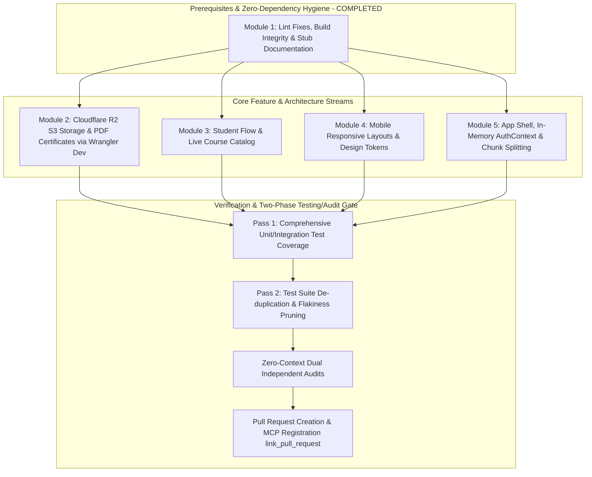

# Doctor App Demo — Master V1 Implementation Plan
**Branch Target:** `feature/v1-readiness-sprint` (following GitFlow, preparing to PR into `dev`)  
**Architecture Methodology:** Modularized Workstreams for Parallel Agent Execution with 2-Phase Progress Gates  
**Status:** RAD implementation wave complete; independent external audit pending
**Explicit Out-of-Scope Items:**  
- Supabase Row Level Security (RLS) — Disabled intentionally for Rapid Application Development (RAD); deferred to post-feature phase.
- Ozow Payment Gateway — Handled under a separate ticket/workstream.
- Stub Components Retained — `AboutDoctor.tsx`, `AboutWebsite.tsx`, `Navbar.tsx`, `SideNav.tsx`, and `AdminGrades.tsx` are documented and kept as explicit stubs until formal replacement assets arrive under frontend Issue #5.

---

## 1. High-Level Architecture & Dependency Graph

To prevent merge conflicts, file locking, and dependency tangles across parallel worker agents, work is organized into **5 decoupled modules** sequenced with automated gates:



---

## 2. Decoupled Workstream Specifications

> These module checklists preserve the original scope. Descriptions of pre-existing behavior are baseline notes, not current defect reports. See Section 5 for RAD completion, deferred items, and remaining verification; do not treat the post-RAD certificate/R2 work or unverified browser flows as completed.

### Module 1: Build Integrity, Linter Fixes & Stub Documentation (COMPLETED)
> **Assigned Scope:** Build stability, zero console/linter warnings, clear stub documentation.  
> **Target Files:** `src/pages/StudentCourseDetails.tsx`, `src/pages/AdminCourseDetails.tsx`, `src/components/`, `src/pages/AdminGrades.tsx`.

- [x] **1.1 Fix Synchronous State Update in Effect (`StudentCourseDetails.tsx:173`):**
  - Guarded with `if (!id) return;` at effect start; eliminated cascading re-render error.
- [x] **1.2 Fix Missing Dependency in Hook (`AdminCourseDetails.tsx:283`):**
  - Wrapped `loadData` in `useCallback(..., [id])` and supplied `[loadData]` to `useEffect`.
- [x] **1.3 Annotate Stub Files:**
  - Clearly documented `SideNav.tsx`, `AboutDoctor.tsx`, `AboutWebsite.tsx`, `Navbar.tsx`, and `AdminGrades.tsx` with stub annotations referencing frontend Issue #5.
- [ ] **1.4 Audit Native Browser `alert()` Dialogs (baseline line references unverified):**
  - Check the current course/admin workflows for blocking `alert(...)` calls and replace any remaining instances with accessible inline feedback. The line references from the original checklist are historical.

---

### Module 2: Cloudflare R2 S3 Storage & PDF Certificates (Issue #3; deferred post-RAD)
> **Assigned Scope:** 1-page completion certificates stored in Cloudflare R2 via S3-compatible API.  
> **RAD status:** Browser R2 upload code and the nonfunctional Wrangler config were removed. This original scope remains deferred until there is a trusted server upload path and authoritative completion data; do not treat the old local-emulation instructions as a working setup.
> **Target Files:** `src/lib/storage.ts`, `src/lib/certificateGenerator.ts`, `src/pages/StudentGrades.tsx`, `src/lib/studentCourses.ts`.

- [ ] **2.1 Cloudflare R2 Storage Adapter (`src/lib/storage.ts`):**
  - Keep R2 credentials server-side. The browser must call a trusted Worker/API or use a short-lived, narrowly scoped signed upload URL; never expose access keys through `VITE_*` variables.
  - Configure the server-side R2 endpoint, bucket, and public/private download policy. Local emulation must run through a real Worker entry point and R2 binding.
  - Implement functions:
    ```typescript
    export async function uploadCertificateToR2(key: string, pdfBlob: Blob): Promise<string>;
    export function getCertificatePublicUrl(key: string): string;
    ```
- [ ] **2.2 Local Wrangler Dev Setup for Offline/CI Testing:**
  - Configure `wrangler.toml` with R2 bucket binding for local emulation:
    ```bash
    npx wrangler dev --remote=false
    ```
  - Enables full end-to-end testing of PDF certificate upload and download without incurring Cloudflare bandwidth or requiring live internet during development.
- [ ] **2.3 1-Page PDF Certificate Generation (`src/lib/certificateGenerator.ts`):**
  - Add `pdf-lib` (clean, lightweight, pure JavaScript, zero DOM/canvas dependency).
  - Implement 1-page landscape certificate template:
    - Dimensions: Standard A4 Landscape (`841.89 x 595.28` pt).
    - Design: Navy & Gold border matching platform editorial branding.
    - Fields: Recipient Name, Course Title, Issue Date, Instructor Name & SANC accreditation, Unique Verification ID (UUID).
    - Output: Returns `Uint8Array` / `Blob` ready for direct browser download and R2 upload.
- [ ] **2.4 Decouple Academic Status from Payment & Wire UI (official workflow deferred):**
  - RAD labels local PDF output as a demo preview. Do not treat payment as a grade or expose an official certificate until authoritative completion records and a trusted issuance path exist.

---

### Module 3: Student Flow & Live Course Discovery Catalog
> **Baseline scope:** This checklist records the original requested work. Current completion and remaining findings are summarized in Section 5.
> **Assigned Scope:** Eliminate student workflow dead ends, compose landing page, connect live Supabase queries.  
> **Target Files:** `src/pages/Home.tsx`, `src/pages/StudentCourses.tsx`, `src/pages/StudentLanding.tsx`, `src/pages/AdminLanding.tsx`.

- [x] **3.1 Compose the public landing page (`src/pages/Home.tsx`):** Duplicate landing sections were removed. Keep imports aligned with current named exports; do not restore the obsolete default `Hero` import example from the original plan.
- [x] **3.2 Build Course Catalog Discovery (`StudentCourses.tsx`):** Enrolled courses and the active course catalog are available; catalog failures are surfaced. Session-specific booking remains constrained by the booking schema.
- [x] **3.3 Connect Student Dashboard to available live data (`StudentLanding.tsx`):** Replaced unsupported sample dashboard content with data available from current tables and surfaced query failures. Upcoming session and grade summaries remain limited by missing session/grade records.
- [x] **3.4 Connect Admin Dashboard Metrics to available live queries (`AdminLanding.tsx`):** Metrics and query errors use available records; the numbers are not payment-provider-verified accounting.

---

### Module 4: Mobile Responsive Layouts & Design Tokens (WCAG 2.1 AA)
> **Assigned Scope:** Mobile sidebar drawer, table scroll containers, contrast compliance, accessible modals.  
> **Target Files:** `src/components/AdminSidebar.tsx`, `src/components/StudentSidebar.tsx`, `src/pages/*.tsx`.

- [x] **4.1 Mobile Responsive Navigation & Page Offsets:** Shared layouts already provided mobile drawers; the RAD wave removed duplicate routed-page offsets and improved phone layouts. Full browser QA remains pending.
- [x] **4.2 Horizontal Scroll Containers for Data Tables:** Added responsive table handling in the listed admin/student workflows. Full browser QA remains pending.
- [ ] **4.3 WCAG 2.1 AA Contrast Ratios:**
  - **Gold Primary Buttons:** Change button label text from white (`#FFFFFF`) to dark slate (`#111110`) on `#C9A84C` (achieves **10.2:1** contrast ratio).
  - **Teal Primary Buttons:** Darken base teal to `#0E7468` (achieves **4.58:1** contrast ratio with `#FFFFFF`).
  - **Teal Badges:** Darken text color to `#0F5B52` on light `#E6F7F5` backgrounds.
  - **Muted Text:** Update `--text-3` and `--s-text-3` to `#64748B` (4.72:1).
- [ ] **4.4 Accessible Modals & Form Associations:**
  - Add `Escape` key listeners and focus trapping (`useFocusTrap`) to `AddCourseModal`, `ChangeRoleModal`, and `AddSessionModal`.
  - Ensure all form inputs in `StudentProfile.tsx` and `Register.tsx` have matching `<label htmlFor="id">` and `<input id="id">` attributes.
  - Add explicit `aria-label` to table action buttons.

---

### Module 5: App Shell, In-Memory AuthContext & Chunk Splitting
> **Assigned Scope:** Performance, route caching, eliminate blank screen flash, global error boundary.  
> **Target Files:** `src/context/AuthContext.tsx`, `src/App.tsx`, `src/components/RequireAuth.tsx`, `src/components/ErrorBoundary.tsx`, `vite.config.ts`.

- [x] **5.1 Auth State Loading & Failure Handling:** Auth state now presents loading and lookup-failure states instead of treating them as a normal signed-out state. Browser workflow verification remains pending.
- [x] **5.2 Maintain React Router Layout Architecture:** Nested Admin and Student routes were baseline behavior; allowed-role checks are in place. Production-host SPA history fallback still needs deployment verification.
- [ ] **5.3 Verify Route Lazy Loading & Vite Chunks (verification open):** Route lazy loading was baseline behavior and the production build passes. Bundle sizes have not been compared against an agreed baseline.
- [ ] **5.4 Improve Error Boundary Recovery (verification open):** The application-level boundary was baseline behavior. Review fallback recovery and route-level handling during external audit/browser QA.

---

## 3. Progress Gates & Testing Protocol

### Two-Pass Testing Gate
1. **Pass 1 — Coverage & Validation:**
   - Implement unit and integration tests covering certificate PDF generation, Cloudflare R2 uploads, route protection guards, and student course catalog filtering.
   - Verify all critical failure modes have corresponding tests.
2. **Pass 2 — De-duplication & Cleanliness:**
   - Audit the test suite to prune duplicate or overlapping test cases.
   - Remove brittle tests that assert purely on DOM markup styles or implementation details.
   - Verify fast, deterministic execution (<5 seconds total test run time).

### Progress Gate Protocol Prior to PR & Merge
1. **Automated Health Gate:**
   - `npm run lint` → 0 errors, 0 warnings.
   - `npx tsc -b` → 0 type errors.
   - `npm run build` → clean chunked build.
2. **Two-Phase Dual Model Review Gate:**
   - Auditor A: Code quality, edge cases, and performance checks.
   - Auditor B: User workflow, R2 storage integrity, and responsive layout checks.
3. **Pull Request Linking Protocol:**
   - Push `feature/v1-readiness-sprint`.
   - Open Pull Request targeting `dev` via `gh pr create`.
   - Call `link_pull_request` MCP tool with the full PR URL immediately after creation.
   - Confirm PR link status via `list_thread_pull_requests`.
   - Once Stefan's PR merges to `dev`, rebase `feature/v1-readiness-sprint` onto `dev` and resolve any minor merge conflicts.

---

## 4. Full-System Audit Addendum (2026-09-26)

This is the initial source-inspection baseline, not a statement that every finding remains open. Current status is reconciled in Section 5. It does not authorize production credentials or assume checked-in SQL matches the deployed Supabase schema. RLS is intentionally disabled during RAD: **do not enable RLS or run the production policy script in this implementation wave.** Keep policy review and enablement as a post-RAD release gate. The reported booking mapping below came from the prior investigation and was not freshly verified against the live database.

### P0 — RAD implementation safeguards and post-RAD security gate

- [x] **Move R2 credentials out of the browser (baseline finding; addressed for RAD).** The browser upload module and nonfunctional Wrangler config were removed. Trusted upload, any needed key rotation, and official certificate storage remain deferred; see Section 5.
- [x] **Enforce role allowlists in the client route groups (baseline finding; addressed in RAD).** The client guard now checks allowed roles. Client routing remains a usability control, not a security boundary; database/server authorization remains required post-RAD.

### Post-RAD — RLS and privacy enablement gate (deferred; do not execute now)

- [ ] **Harden policies before enabling RLS.** Treat `scripts/production-rls-policies.sql` as a draft. It permits anonymous profile inserts when `auth.uid()` is null; users can update their own `role_id` and `active`; and users can update their own booking `payment_status`. Restrict profile creation to the student role, limit self-updates to profile fields, reserve role/activation/payment changes for trusted operations, review `SECURITY DEFINER` search paths and grants, add needed least-privilege `instructors`/`locations` policies, and constrain public reads.
- [ ] **Remove permissive instructor-assignment policies.** `scripts/ensure-instructor-courses.sql` grants every authenticated user `FOR ALL`; adding an admin policy does not cancel it because permissive policies are combined. Replace development policies explicitly and verify effective grants/policies on the deployed database.
- [ ] **Protect personal information.** Registration stores national ID/passport, phone, and professional registration fields in `users`. Before production use, verify RLS is enabled and each role sees only the necessary rows and fields. Apply and verify the production migration only after RAD is complete.

### P1 — Make enrolment, grades, and certificates trustworthy

- [ ] **Choose and document the session booking schema.** For the current RAD query, use the reported deployed mapping `bookings.course_session_id -> courses.id`; do not query the nonexistent `bookings.course_id`. This does not identify an individual session. For session capacity and rosters, settle on a separate/renamed booking FK to `course_sessions`, migrate/backfill safely, and update the affected queries and `scripts/seed-demo.mjs` together. Add an atomic capacity check and prevent duplicate bookings for the same user/session.
- [ ] **Define a trusted booking/payment lifecycle.** `StudentCourseDetails.tsx` leaves “Book now” disabled; enabling RLS alone will not implement booking or payment. Specify the states and transitions, create pending bookings through a trusted operation, and accept paid status only from the payment provider's verified server callback. Ozow remains a separate integration scope, but the client must not be able to mark a booking paid.
- [ ] **Use a real completion record for grades and certificates (open).** RAD now labels generated PDFs as local demo previews and does not upload them. Add an authoritative grade/completion record before implementing official pass/fail results and certificate issuance.
- [ ] **Make course/session creation complete and atomic (partially open).** The baseline flow used default session values; the RAD wave added editable session details. Course/session/instructor writes still need trusted atomic handling or clear recovery when a later step fails. See the latest partial-creation finding in Section 5.
- [ ] **Keep seat counts and rosters session-specific.** The original audit found course-level roster grouping. RAD removes unsupported session/seat claims where the schema cannot support them; accurate per-session rosters and capacity still require a booking session FK.

### P1 — Close account lifecycle and authorization gaps

- [x] **Finish account recovery and email/profile synchronization (RAD handling implemented).** Recovery, signup/profile write errors, and Auth/profile email update feedback were addressed in the RAD wave. Trusted profile provisioning remains a post-RAD requirement.
- [x] **Show auth loading and profile lookup failures (RAD UI addressed).** Loading and lookup errors have distinct states; verify the flows in browser QA. **Post-RAD:** privileged writes still require database/server authorization, alongside RLS and trusted operations.
- [ ] **Make instructor role changes transactional (open).** The RAD dialog provides recovery for assignment failures, but role, instructor-record, and course-assignment writes still need a trusted operation or compensating rollback to avoid partial state.
- [ ] **Provision signup profiles from a trusted source (post-RAD).** Client-side repair no longer trusts editable metadata for privileged roles; authoritative student-role assignment still requires a database trigger or server-side provisioner.

### P2 — Correct live data, usability, and operations

- [x] **Filter the student catalog to active courses (baseline finding; addressed in RAD).** The catalog filters inactive courses and surfaces query failures.
- [x] **Replace supported dashboard placeholders and repair metrics (RAD handling implemented).** Dashboard data/errors and admin revenue source were updated using available tables. Metrics remain constrained by the current schema and are not payment-provider-verified accounting.
- [x] **Make catalog failures and demo states explicit (baseline finding; addressed in RAD).** Catalog errors are surfaced, inactive courses are filtered, and unsupported dashboard data is not represented as authoritative.
- [x] **Complete responsive fixes from Module 4 (RAD handling implemented).** Routed page offsets, phone layouts, table overflow, and course tag wrapping were addressed in the listed workstream files.
- [ ] **Finish accessible interaction details.** Ensure registration labels are programmatically associated with inputs; trap and restore focus in dialogs; provide keyboard-operable mobile navigation; and verify visible loading, empty, and error states across flows.
- [ ] **Make checks/deployment match reality.** Keep migrations/policies versioned and repeatable, add CI checks for lint/typecheck/build and critical auth/booking flows, and verify the production build contains no private keys. The initial audit recorded limited role/certificate test coverage; recheck current coverage before treating that baseline as current.
- [ ] **Resolve dependency advisories.** `npm audit` reported 17 advisories in the RAD dependency tree (2 low, 3 moderate, 12 high, 0 critical; npm reports fixes available). Review the affected dependency paths and compatibility, apply deliberate upgrades, then rerun audit and build. Do not apply an unreviewed bulk upgrade as part of this wave.
- [ ] **Harden demo seeding and deployment.** Keep `scripts/seed-demo.mjs` local-only with a project/environment allowlist; validate role IDs and fail when role setup fails. Confirm the production host rewrites deep links to `index.html` and document deployment, environment variables, migrations, RLS, and secret rotation; no host fallback configuration is currently checked in.

### Initial audit context and deferred constraints

- `src/App.tsx` already has nested role layouts, lazy-loaded pages, and an error boundary; `AuthContext.tsx`, layout drawers, the certificate generator, and role/certificate tests also exist. Do not assign the corresponding “create/refactor” tasks in Modules 2, 4, or 5 as if these were absent; inspect and extend what is there.
- The remaining responsive work is the routed page offset/grid/table behavior above. The shared layout itself already resets its offset on mobile.
- `PRODUCT_AUDIT_REPORT.md` and `AUDIT_REPORT.md` contain stale claims (including the current booking schema, missing error boundary/tests, and registration profile creation). Reconcile those reports with the deployed schema and current source before treating them as implementation requirements.
- Root `IMPLEMENTATION.md` instructs work on `vaperizer2`, while this plan targets `feature/v1-readiness-sprint`; the current branch is `feature/v1-readiness-sprint`. Reconcile branch/worktree guidance so future agents do not implement against the wrong branch.

### RAD parallel implementation wave (completed)

Keep these file boundaries separate to minimize shared-file conflicts. Agents must not enable RLS, run SQL against the live project, add secrets to `VITE_*`, or claim official completion certificates without persisted grade records.

1. **Responsive UI and public landing:** `src/styles/studentPages.css`, `src/styles/adminPages.css`, `src/pages/Home.tsx`. Remove duplicate page offsets, fix narrow grids/tables/course tags, and remove duplicated landing sections.
2. **Student data and dashboards:** `src/lib/studentCourses.ts`, `src/lib/classLists.ts`, `src/pages/StudentCourses.tsx`, `src/pages/StudentLanding.tsx`, `src/pages/StudentCourseDetails.tsx`. Use the currently reported deployed booking column `course_session_id` only for course relationships; do not invent a session FK. Filter active catalog rows, surface failures, remove misleading seat counts/roster claims where the schema cannot support them, and replace sample dashboard content where supported by current tables.
3. **Account lifecycle:** `src/pages/ForgotPassword.tsx`, `src/pages/Register.tsx`, `src/pages/Login.tsx`, `src/pages/StudentProfile.tsx`, `src/App.tsx`, `src/lib/auth.ts`. Implement recovery, clear signup/profile-write errors, sensible Auth messages, and prevent editable metadata from assigning privileged roles. Leave SQL/RLS enablement for post-RAD.
4. **Admin course/users workflows:** `src/pages/AdminLanding.tsx`, `src/pages/AdminCourse.tsx`, `src/pages/AdminCourseDetails.tsx`, `src/pages/AdminUsers.tsx`, `src/lib/instructorCourses.ts`. Correct metric/error handling, make session details editable, and recover cleanly from partial role/assignment failures. Keep client-only RAD behavior explicitly non-secure.
5. **Certificate/R2 RAD boundary:** `src/lib/storage.ts`, `src/lib/certificateGenerator.ts`, `src/pages/StudentGrades.tsx`, `wrangler.toml` and any Worker entry point. Eliminate browser credentials. Without a persisted grade table, implement only clearly labeled local demo previews; defer official certificate issuance and durable upload until completion records and a trusted authorization path exist.

The T3 Code preview tools are `preview_open` (use `open: true` and `show: true`), `preview_navigate`, `preview_snapshot`, `preview_resize`, `preview_click`, `preview_type`, and `preview_evaluate`; use `{target:{kind:"environment-port",port:<Vite port>}}` for the workspace dev server. The preview automation tools are the harness browser surface; do not substitute a standalone browser session.

## 5. RAD status and follow-up register (2026-09-26)

- Responsive pages, landing duplication, active course catalog/error states, account recovery and signup/profile handling, admin metric/session/role workflows, and the local certificate-preview boundary have been implemented in the listed workstream files.
- R2 browser credentials and the nonfunctional Wrangler config were removed. Trusted R2 upload and official certificate issuance remain deferred until a server-side upload path and authoritative completion records exist.
- The deployed booking column mapping above is an input from the prior schema investigation, not a fresh live database inspection. Session-specific roster and seat counts remain unavailable until the booking schema includes a session FK.
- Removed the unused `@aws-sdk/client-s3` dependency along with its browser upload module. `npm audit` still reports 17 advisories (12 high); dependency remediation remains on the external audit list.
- RLS remains disabled for RAD. The policy/privacy items above remain a post-RAD gate; no RLS SQL was run.
- TypeScript and production build validation passed for the implementation wave. The T3 in-app preview showed the public landing/login at desktop and phone widths, but its automation host became unavailable before a complete final visual pass. Independent external audit has not yet occurred.

### Latest audit findings status

- [x] **Recover the role-change dialog after save errors (P1).** Editing role/course selections clears the prior error and allows another save attempt. Build passed; browser workflow QA remains pending.
- [x] **Handle partial course creation (P1).** Creation failures preserve the entered form state and provide recovery instead of silently discarding the form. This remains client-side RAD behavior, not a trusted transaction. Build passed; browser workflow QA remains pending.
- [x] **Prevent student course header overflow on narrow phones (P1).** Header and search layout now reflow at narrow widths. Build passed; full visual browser QA remains pending.
- [x] **Represent missing grades honestly (P2).** Missing grade records are shown as unavailable/not recorded rather than pending academic results. Official grading remains deferred until authoritative records exist.
- [x] **Add visible auth loading and lookup-failure states (P2).** Loading and profile lookup failures now have distinct UI states. Browser workflow QA remains pending.
- [x] **Reconcile plan text against source (P2).** Removed the obsolete default `Hero` import instructions, labeled the audit as a baseline, and aligned module statuses with the RAD changes and open work. External audit remains pending.
