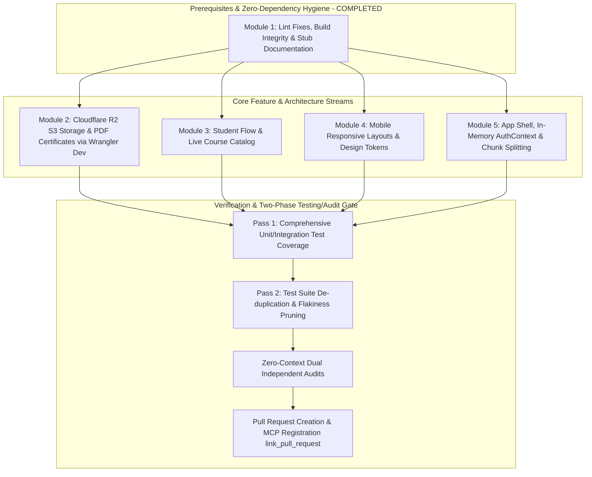

# Doctor App Demo — Master V1 Implementation Plan
**Branch Target:** `feature/v1-readiness-sprint` (following GitFlow, preparing to PR into `dev`)  
**Architecture Methodology:** Modularized Workstreams for Parallel Agent Execution with 2-Phase Progress Gates  
**Status:** Validated through Dual Multi-Model Audits  
**Explicit Out-of-Scope Items:**  
- Supabase Row Level Security (RLS) — Disabled intentionally for Rapid Application Development (RAD); deferred to post-feature phase.
- Ozow Payment Gateway — Handled under a separate ticket/workstream.
- Stub Components Retained — `AboutDoctor.tsx`, `AboutWebsite.tsx`, `Navbar.tsx`, `SideNav.tsx`, and `AdminGrades.tsx` are documented and kept as explicit stubs until formal replacement assets arrive under frontend Issue #5.

---

## 1. High-Level Architecture & Dependency Graph

To prevent merge conflicts, file locking, and dependency tangles across parallel worker agents, work is organized into **5 decoupled modules** sequenced with automated gates:



---

## 2. Decoupled Workstream Specifications

### Module 1: Build Integrity, Linter Fixes & Stub Documentation (COMPLETED)
> **Assigned Scope:** Build stability, zero console/linter warnings, clear stub documentation.  
> **Target Files:** `src/pages/StudentCourseDetails.tsx`, `src/pages/AdminCourseDetails.tsx`, `src/components/`, `src/pages/AdminGrades.tsx`.

- [x] **1.1 Fix Synchronous State Update in Effect (`StudentCourseDetails.tsx:173`):**
  - Guarded with `if (!id) return;` at effect start; eliminated cascading re-render error.
- [x] **1.2 Fix Missing Dependency in Hook (`AdminCourseDetails.tsx:283`):**
  - Wrapped `loadData` in `useCallback(..., [id])` and supplied `[loadData]` to `useEffect`.
- [x] **1.3 Annotate Stub Files:**
  - Clearly documented `SideNav.tsx`, `AboutDoctor.tsx`, `AboutWebsite.tsx`, `Navbar.tsx`, and `AdminGrades.tsx` with stub annotations referencing frontend Issue #5.
- [ ] **1.4 Replace Native Browser `alert()` Dialogs:**
  - Replace blocking `alert(...)` calls in `AdminCourse.tsx` (lines 357, 360) and `AdminCourseDetails.tsx` (lines 286, 299) with non-modal toast notifications or accessible inline banner alerts.

---

### Module 2: Cloudflare R2 S3 Storage & PDF Certificates (Issue #3)
> **Assigned Scope:** 1-page completion certificates stored in Cloudflare R2 via S3-compatible API.  
> **Testing Environment:** Local testing supported via `wrangler dev` (Cloudflare Workers/R2 local emulation).  
> **Target Files:** `src/lib/storage.ts`, `src/lib/certificateGenerator.ts`, `src/pages/StudentGrades.tsx`, `src/lib/studentCourses.ts`.

- [ ] **2.1 Cloudflare R2 Storage Adapter (`src/lib/storage.ts`):**
  - Install `@aws-sdk/client-s3` (or lightweight S3 fetch client compatible with Cloudflare R2).
  - Configure S3 client pointing to Cloudflare R2 endpoint:
    - Endpoint: `https://<CLOUDFLARE_ACCOUNT_ID>.r2.cloudflarestorage.com` (or local emulator via `wrangler dev`)
    - Region: `auto`
    - Credentials: `VITE_R2_ACCESS_KEY_ID` & `VITE_R2_SECRET_ACCESS_KEY`
    - Bucket: `VITE_R2_BUCKET_NAME`
    - Public Domain: `VITE_R2_PUBLIC_URL`
  - Implement functions:
    ```typescript
    export async function uploadCertificateToR2(key: string, pdfBlob: Blob): Promise<string>;
    export function getCertificatePublicUrl(key: string): string;
    ```
- [ ] **2.2 Local Wrangler Dev Setup for Offline/CI Testing:**
  - Configure `wrangler.toml` with R2 bucket binding for local emulation:
    ```bash
    npx wrangler dev --remote=false
    ```
  - Enables full end-to-end testing of PDF certificate upload and download without incurring Cloudflare bandwidth or requiring live internet during development.
- [ ] **2.3 1-Page PDF Certificate Generation (`src/lib/certificateGenerator.ts`):**
  - Add `pdf-lib` (clean, lightweight, pure JavaScript, zero DOM/canvas dependency).
  - Implement 1-page landscape certificate template:
    - Dimensions: Standard A4 Landscape (`841.89 x 595.28` pt).
    - Design: Navy & Gold border matching platform editorial branding.
    - Fields: Recipient Name, Course Title, Issue Date, Instructor Name & SANC accreditation, Unique Verification ID (UUID).
    - Output: Returns `Uint8Array` / `Blob` ready for direct browser download and R2 upload.
- [ ] **2.4 Decouple Academic Status from Payment & Wire UI:**
  - Fix `src/lib/studentCourses.ts`: Stop mapping `passed` directly to `payment_status === "paid"`. Real course completion must reflect completion records.
  - In `src/pages/StudentGrades.tsx`: For any course with status `passed`, render an active **"Download Certificate"** button that invokes certificate generation or retrieves the cached R2 PDF.

---

### Module 3: Student Flow & Live Course Discovery Catalog
> **Assigned Scope:** Eliminate student workflow dead ends, compose landing page, connect live Supabase queries.  
> **Target Files:** `src/pages/Home.tsx`, `src/pages/StudentCourses.tsx`, `src/pages/StudentLanding.tsx`, `src/pages/AdminLanding.tsx`.

- [ ] **3.1 Complete Public Landing Page Composition (`src/pages/Home.tsx`):**
  - Update `Home.tsx` to render the rich components exported by `Hero.tsx`:
    ```tsx
    import Hero, { AboutWebsite, AboutDoctor } from "../components/Hero";
    export default function Home() {
      return (
        <main>
          <Hero />
          <AboutWebsite />
          <AboutDoctor />
        </main>
      );
    }
    ```
- [ ] **3.2 Build Course Catalog Discovery (`StudentCourses.tsx`):**
  - Add a segmented view or tab switch:
    - Tab 1: **"My Enrolled Courses"** (existing active bookings).
    - Tab 2: **"Course Catalog"** (queries all active courses from `courses` table).
  - Clicking an un-enrolled course navigates to `StudentCourseDetails` to view syllabus, sessions, and upcoming dates.
- [ ] **3.3 Connect Student Dashboard to Live Supabase Data (`StudentLanding.tsx`):**
  - Replace hardcoded mock data ("Welcome back, John", "Lobotomy 101", static arrays) with:
    - Real student name from `getSessionUser()`.
    - Live upcoming session query from `bookings` joining `course_sessions` and `courses`.
    - Live grade summary counts.
- [ ] **3.4 Connect Admin Dashboard Metrics to Live Queries (`AdminLanding.tsx`):**
  - Replace static stat counts ("1,284 students", "32 courses", "R 54k revenue") with live Supabase aggregation counts from `users`, `courses`, and `bookings`.

---

### Module 4: Mobile Responsive Layouts & Design Tokens (WCAG 2.1 AA)
> **Assigned Scope:** Mobile sidebar drawer, table scroll containers, contrast compliance, accessible modals.  
> **Target Files:** `src/components/AdminSidebar.tsx`, `src/components/StudentSidebar.tsx`, `src/pages/*.tsx`.

- [ ] **4.1 Mobile Responsive Navigation Drawer:**
  - Build responsive mobile drawer state into `AdminSidebar` and `StudentSidebar` with a floating hamburger button and dark backdrop overlay on viewports `<1024px`.
  - In CSS media query (`@media (max-width: 1024px)`):
    - Reset main content margins (`.main-content`, `.sl-main`, `.sp-main`) from `228px`/`224px` to `0`.
- [ ] **4.2 Horizontal Scroll Containers for Data Tables:**
  - Wrap tables in `overflow-x: auto` containers with `-webkit-overflow-scrolling: touch` across `AdminLanding`, `AdminUsers`, `AdminCourseDetails`, and `StudentCourseDetails` so status toggles and action buttons are not clipped off screen.
- [ ] **4.3 WCAG 2.1 AA Contrast Ratios:**
  - **Gold Primary Buttons:** Change button label text from white (`#FFFFFF`) to dark slate (`#111110`) on `#C9A84C` (achieves **10.2:1** contrast ratio).
  - **Teal Primary Buttons:** Darken base teal to `#0E7468` (achieves **4.58:1** contrast ratio with `#FFFFFF`).
  - **Teal Badges:** Darken text color to `#0F5B52` on light `#E6F7F5` backgrounds.
  - **Muted Text:** Update `--text-3` and `--s-text-3` to `#64748B` (4.72:1).
- [ ] **4.4 Accessible Modals & Form Associations:**
  - Add `Escape` key listeners and focus trapping (`useFocusTrap`) to `AddCourseModal`, `ChangeRoleModal`, and `AddSessionModal`.
  - Ensure all form inputs in `StudentProfile.tsx` and `Register.tsx` have matching `<label htmlFor="id">` and `<input id="id">` attributes.
  - Add explicit `aria-label` to table action buttons.

---

### Module 5: App Shell, In-Memory AuthContext & Chunk Splitting
> **Assigned Scope:** Performance, route caching, eliminate blank screen flash, global error boundary.  
> **Target Files:** `src/context/AuthContext.tsx`, `src/App.tsx`, `src/components/RequireAuth.tsx`, `src/components/ErrorBoundary.tsx`, `vite.config.ts`.

- [ ] **5.1 In-Memory `AuthContext`:**
  - Create `src/context/AuthContext.tsx` providing `{ user, role, loading, refreshUser }`.
  - Listen to `supabase.auth.onAuthStateChange` to keep session in memory.
  - Update `RequireAuth.tsx` to read from `AuthContext` instead of executing an un-cached async database round-trip on every navigation, eliminating the blank screen route flash.
- [ ] **5.2 React Router Layout Architecture:**
  - Refactor `src/App.tsx` from 17 flat routes into structured layout routes:
    - `<Route element={<PublicLayout />}>` (Home, Login, Register, ForgotPassword)
    - `<Route element={<AdminLayout />}>` (Dashboard, Courses, Course Details, Users)
    - `<Route element={<StudentLayout />}>` (Student Landing, Courses, Details, Grades, Profile, Notifications)
- [ ] **5.3 Route Lazy Loading & Vite Manual Chunks:**
  - Convert route component imports in `App.tsx` to `React.lazy(() => import(...))` wrapped in `<Suspense fallback={<LoadingSpinner />}>`.
  - Configure `vite.config.ts` manualChunks to separate `vendor-react`, `vendor-supabase`, and `vendor-icons`.
  - Reduces initial entry bundle from **598 kB** to **<90 kB gzip**.
- [ ] **5.4 Global Error Boundary:**
  - Create `src/components/ErrorBoundary.tsx` wrapping the application root to prevent unexpected runtime errors from blanking out the entire screen.

---

## 3. Progress Gates & Testing Protocol

### Two-Pass Testing Gate
1. **Pass 1 — Coverage & Validation:**
   - Implement unit and integration tests covering certificate PDF generation, Cloudflare R2 uploads, route protection guards, and student course catalog filtering.
   - Verify all critical failure modes have corresponding tests.
2. **Pass 2 — De-duplication & Cleanliness:**
   - Audit the test suite to prune duplicate or overlapping test cases.
   - Remove brittle tests that assert purely on DOM markup styles or implementation details.
   - Verify fast, deterministic execution (<5 seconds total test run time).

### Progress Gate Protocol Prior to PR & Merge
1. **Automated Health Gate:**
   - `npm run lint` → 0 errors, 0 warnings.
   - `npx tsc -b` → 0 type errors.
   - `npm run build` → clean chunked build.
2. **Two-Phase Dual Model Review Gate:**
   - Auditor A: Code quality, edge cases, and performance checks.
   - Auditor B: User workflow, R2 storage integrity, and responsive layout checks.
3. **Pull Request Linking Protocol:**
   - Push `feature/v1-readiness-sprint`.
   - Open Pull Request targeting `dev` via `gh pr create`.
   - Call `link_pull_request` MCP tool with the full PR URL immediately after creation.
   - Confirm PR link status via `list_thread_pull_requests`.
   - Once Stefan's PR merges to `dev`, rebase `feature/v1-readiness-sprint` onto `dev` and resolve any minor merge conflicts.
